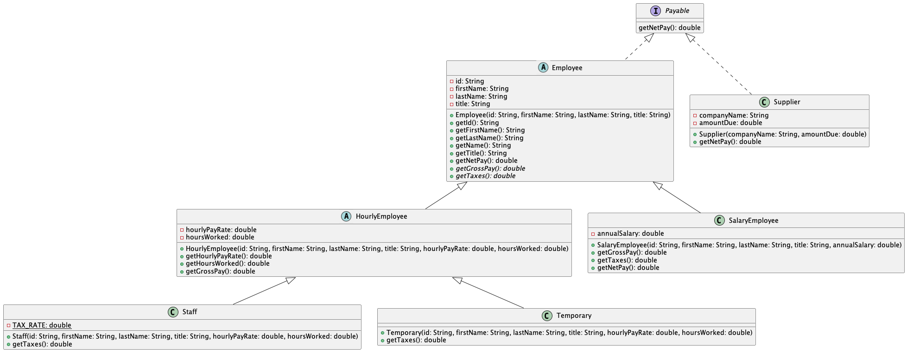

# Programming II

## Lab 4.0 - Inheritance

An introduction to using classes and constructors in the Java programming language.

This is a lab assignment based on one used in Computer Science II (CSCE 156 & 156H) in the School of Computing
at the University of Nebraska-Lincoln. 
Originally written by Chris Bourke. Revised and modified by Sarah Roscoe for CS222 at [Saint Mary's College of California](https://www.stmarys-ca.edu/) in Fall 2024. 

## Overview

### Resources

-  Read the following tutorial on inheritance in Java
  <https://docs.oracle.com/javase%2Ftutorial%2F/java/IandI/subclasses.html>

-  Read about interfaces in Java  
   <https://docs.oracle.com/javase/tutorial/java/IandI/createinterface.html>

-  Read about abstract methods and abstract classes in Java  
   <https://docs.oracle.com/javase/tutorial/java/IandI/abstract.html>

### Lab Objectives & Topics

Following the lab, you should:

-   Understand Inheritance and design classes and subclasses in Java

-   Understand and use interfaces and abstract classes in Java

-   Understand and use the `implements` and `extends` keywords

### Pair Programming

You may work on this lab with a partner. You may work on one piece of code, but both of you should submit the work. You may send your partner a copy of the file and therefore turn in identical copies. You should also indicate on Canvas who you worked with. **Both of you should indicate your partner in a submission comment**. 

In pair programming, one person is the *driver* and the other is the *navigator*. The driver is responsible for the computer keyboard and mouse. The navigator is responsible for figuring out what should be done, and telling the driver what to do. Neither role is "in charge", but both are responsible for coming up with solutions together. 

Each week, you should try to alternate: if you were the driver last week, you should be navigator this week, or vice versa. Any conflicts should be resolved in your group. 

## 1. Getting Started

Clone this project code for this lab from GitHub in VS Code using the
URL: https://github.com/sroscoe2/CS222-Lab04.git. Refer to Lab 1.0 for
instructions on how to clone a project from GitHub.

## 2. Inheritance

Object Oriented Programming allows you to define a hierarchy of objects
using *inheritance*. Inheritance promotes code reuse and semantic
relations between objects. Subclasses provide specialization of behavior
by allowing you to override object methods while preserving common
functionality (generalization) defined in the super-class.

As a class-based object-oriented programming language, Java facilitates
inheritance through subclassing by using the keyword extends. If class
*B* `extends` class *A*, *B* is said to be a subclass of *A* (*A* is a
superclass of *B*). Instances of class *B* are also instances of class
*A*, defining an "is-a" relation between them. Java also provides two
mechanisms related to subclassing.

-   *Abstract Classes* – Java allows you to specify that a class is
    abstract using the keyword `abstract`. In an abstract class, you can define
    not only normal methods (which you provide a "default"
    implementation for) but you can also define abstract methods:
    methods that you do not need to provide an implementation for.
    Instead, it is the responsibility of non-abstract subclass(es) to
    provide an implementation. In addition, if a class is abstract, you
    are prevented from instantiating any instances of it.

-   *Interfaces* – Java allows you to define interfaces, which are
    essentially pure abstract classes. Interfaces specify the methods
    that a class must provide in order to implement the interface. Java
    allows you to define an interface that specifies the public
    interface (methods) of a class. Classes can then be defined to
    implement an interface using the `implements` keyword. One advantage of
    interfaces is that it does not lock your classes into a rigid
    hierarchy; however objects that implement an interface can still be
    considered to have the is-a relationship. In addition, interfaces
    can be used to simulate multiple-inheritance in Java as classes can
    implement more than one interface.

## 3. Activities 

You will explore these concepts by completing a Java program that
simulates a basic weekly payroll reporting system for a
corporation. Every employee has an employee ID, a name (first and last),
and a title. Further, there are two types of employees:

-   Salaried employees (type: `"Salary"`) – Salaried employees have a base annual salary,
    which is subject to a 20% income tax rate (state, federal and FICA
    combined). In addition, each salaried employee receives a $100
    post-tax benefits allowance.

-   Hourly employees – Hourly employees have a per-hour pay rate along
    with a weekly total of the number of hours they worked. Hourly
    employees do not receive any benefit allowance. Further, there are
    two types of hourly employees.

    -   Staff employees (type: `"Staff"`) are directly employed by the company and are subject
        to a 15% income tax rate.

    -   Temporary employees (type: `"Temporary"`) are not directly employed by the company, but
        instead are contracted through a third-party temp agency who is
        responsible for collecting taxes (thus no taxes are taken from
        their gross pay).

Employee data is stored in a flat data file and the basic parsing has
been provided. However, you will need to design and implement Java
classes to support and model this payroll system. By the end of this lab
your class designs should resemble something like the following UML 
Diagram.  A UML (Unified Modeling Language) Diagram is a graphical
representation of classes and their relationships.  

Observe that:

- Inheritance is indicated by the arrows
- Abstract classes and methods have a small "A" in the icon
- Public methods have a green icon and private member variables have red icons
- Method parameters and return types are labeled 

### Note:

The net pay is the gross pay minus taxes.
The gross pay depends on the employee type:

1. Hourly rate times hours worked.
2. Annual salary divided by number of weeks in the year.

The tax is calculated differently, based on the employee type:

1. No tax
2. hourly rate times hours worked times tax rate
3. Take 20% of the annual salary, then divide it by the number of weeks in the year

### 3.1 Class Design & Inheritance 

You have been provided a partially completed program that parses a data
file (in `PayrollReport.java`) and creates `Employee` instances. However, the `Employee` 
class is empty.  You will need to implement this class and any 
relevant subclass(es) to complete the program.

-   Identify the different classes necessary to model each of the
    different types of employees in the problem statement.

-   Identify the relationship between these classes.

-   Identify the state (variables) that are common to these classes and
    the state that distinguishes them. Where do each of these pieces of
    data belong?

-   Identify the behavior (methods) that are common to each of these
    classes–what are methods that should be in the superclass? How
    should subclasses provide specialized behavior?

-   Some state/behavior may be common to several classes–is there an
    opportunity to define an intermediate class?

-   If you need more guidance, consult the UML diagram for one
    possible design.

-   To check your work, a text file containing the expected output has
    been provided in the project (see `output/expectedOutput.txt`)

***VS Code Tip***: Many of the common programming tasks when dealing with
objects can be automated by your IDE. For example: once you have
designed the state (variables) of your class, you can automatically
generate the boilerplate getters, setters, and constructors: when
in the editor for your class, right-click, then click "Source Action" then "Generate Getters
and Setters" or "Generate Constructors..."

***Java Note***: In a subclass, you *must* invoke a constructor in the
superclass and it must be done first. This rule is so that classes
conform to the is-a relationship. Invoking a super class’s constructor
is achieved by using the `super` keyword. If there are multiple constructors,
you may invoke any one of them. Note that if a constructor does not
explicitly invoke a superclass constructor, the Java compiler
automatically inserts a call to the no-argument constructor of the
superclass. If the superclass does not have a no-argument constructor,
you will get a compile-time error. The Java `Object` class has a no-arg
constructor, so if your class does not explicitly extend a class, it
implicitly `extends Object` and the no-arg constructor is invoked.

### 3.2 Abstractions

Now that you have a well designed, functional implementation we will
improve on the design by identifying potential abstractions that can be
made. Start by making the `Employee` class `abstract`. If you had a
good design, then nothing should break; the model did not have any
generic employee.  All employees were of a specific type. If something did
break in your code, rethink your design and make the appropriate
changes.

Identify one or more methods in the `Employee` class that could be made
`abstract`. Are there any methods in the superclass where it
would *not* be appropriate to have a "default" definition? Make these
methods `abstract` and again make any appropriate changes to your design
as necessary.

### 3.3 Adding an Interface

The company also has suppliers that they purchase supplies and
parts from to build their products. Suppliers have a company name and an
amount due, and so need to be paid, but they are not employees. However,
the payroll department would like to have a common interface across all
entities/objects in their system that are, in some way, payable.

1.  Create an `interface` (in VS Code: `Cmd+shift+P`, type `new java file`, select `Java: New Java File`, then select "Interface") called `Payable`. Identify a
    single method in this interface that returns the (net) amount
    payable

2.  Make the `Employee` class implement this new interface and make the appropriate
    changes if necessary

3.  Create a new class, `Supplier` to represent suppliers and also make it `Payable`

### 4. Testing, Submitting & Grading

* Test your programs using the provided JUnit test suite(s).  Fix any
errors and completely debug your programs.
* Compress your Lab project to a zip file and name it `CS222-Lab04smc1` where `smc1` is YOUR SMC username.
* Submit the zip file to Canvas. 

